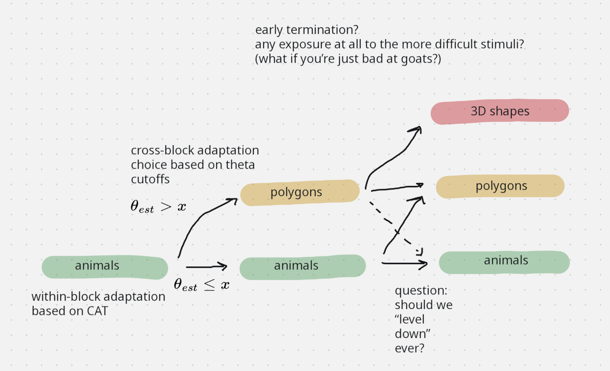

```{r}
#| code-fold: false
#| echo: false

library(rlevante)
library(tidyverse)
library(here)
library(mirt)
library(ggthemes)

source(here("02_score_data/02_fit_irt/registry_helper.R"))
source(here("plot_settings.R"))
```

Goal: figure out thresholds theta value for mental rotation block CAT, i.e. values of $x$ in this diagram.

{width=75%}

### Step 0: Load model records for Rasch and 2PL mrot models and extract their item parameters.

```{r}
recode_mrot_items <- \(df) {
  df |>
    separate(item, into = c("task_code", "item_group", "item_entry", "angle")) |>
    unite("item", "item_group", "item_entry", sep = " ", remove = FALSE) |>
    mutate(itemtype = itemtype |> fct_relevel("Rasch"),
           item_group = item_group |> as_factor(),
           item_entry = item_entry |> as_factor(),
           angle = angle |> as.numeric())
}

mrot_2pl_f1_scalar <- read_rds(here("02_scoring_outputs/model_registry/mrot/multigroup_site/all_items/mrot_2pl_f1_scalar.rds"))
mrot_rasch_f1_scalar <- read_rds(here("02_scoring_outputs/model_registry/mrot/multigroup_site/all_items/mrot_rasch_f1_scalar.rds"))

mod_2pl <- model_from_record(mrot_2pl_f1_scalar)
mod_rasch <- model_from_record(mrot_rasch_f1_scalar)

coef_2pl <- coef(mod_2pl, simplify = TRUE, IRTpars = TRUE)[[1]]$items |> as_tibble(rownames = "item") |> mutate(itemtype = "2PL")
coef_rasch <- coef(mod_rasch, simplify = TRUE, IRTpars = TRUE)[[1]]$items |> as_tibble(rownames = "item") |> mutate(itemtype = "Rasch")
coef_mrot <- bind_rows(coef_rasch, coef_2pl) |>
  rename(difficulty = b, discrimination = a) |>
  mutate(item = str_remove(item, "-[0-9]+$")) |>
  distinct() |>
  recode_mrot_items() |>
  mutate(interpolated = FALSE)

coef_mrot |>
  select(itemtype, item, angle, difficulty, discrimination) |>
  mutate(across(where(is.numeric), \(x) round(x, 2))) |>
  DT::datatable(style = "bootstrap4", rownames = FALSE,
                options = list(pageLength = 12))
```

### Step 1: Interpolate between 2D and 3D items by angle to get parameters for polygon items.

```{r}
poly_items <- expand_grid(
  itemtype = c("Rasch", "2PL"),
  item = c(
    "mrot_2d_polygon1_040",
    "mrot_2d_polygon1_080",
    "mrot_2d_polygon1_120",
    "mrot_2d_polygon1_160",
    "mrot_2d_polygon1_200",
    "mrot_2d_polygon1_240",
    "mrot_2d_polygon1_280",
    "mrot_2d_polygon1_320",
    "mrot_2d_polygon2_040",
    "mrot_2d_polygon2_080",
    "mrot_2d_polygon2_120",
    "mrot_2d_polygon2_160",
    "mrot_2d_polygon2_200",
    "mrot_2d_polygon2_240",
    "mrot_2d_polygon2_280",
    "mrot_2d_polygon2_320"
  )
) |> recode_mrot_items() |>
  mutate(angle = map_dbl(angle, \(a) min(a, 360 - a))) |>
  distinct()

contrasts(coef_mrot$item_group) <- contr.sum(n_distinct(coef_mrot$item_group))
mrot_grid <- expand_grid(item_group = unique(coef_mrot$item_group), angle = unique(poly_items$angle))

param_fits_d <- coef_mrot |>
  nest(coefs = -itemtype) |>
  mutate(param_mod_d = map(coefs, \(cr) lm(difficulty ~ angle * item_group, data = cr)),
         param_fits_d = map(param_mod_d, \(pmod) {
           broom::augment(pmod, newdata = mrot_grid) |>
             group_by(angle) |>
             summarise(difficulty = mean(.fitted))
         })) |>
  select(itemtype, param_fits_d) |>
  unnest(param_fits_d)

param_fits_a <- coef_mrot |>
  nest(coefs = -itemtype) |>
  mutate(param_mod_a = map(coefs, \(cr) lm(discrimination ~ angle * item_group, data = cr)),
         param_fits_a = map(param_mod_a, \(pmod) {
           broom::augment(pmod, newdata = mrot_grid) |>
             group_by(angle) |>
             summarise(discrimination = mean(.fitted))
         })) |>
  select(itemtype, param_fits_a) |>
  unnest(param_fits_a)

param_fits <- left_join(param_fits_d, param_fits_a)

poly_fits <- poly_items |> left_join(param_fits) |> mutate(interpolated = TRUE)
# write_csv(poly_fits, "mrot_poly_fits.csv")
# poly_fits |>
#   select(itemtype, item, angle, difficulty, discrimination) |>
#   mutate(across(where(is.numeric), \(x) round(x, 2))) |>
#   DT::datatable(style = "bootstrap4", rownames = FALSE, autoHideNavigation = TRUE,
#                 options = list(pageLength = 16))
```

```{r}
#| label: mrot_coefs
#| fig-width: 9
#| fig-height: 6
#| out-width: 90%
#| fig.show: hold

coef_combined <- coef_mrot |> bind_rows(poly_fits) |>
  mutate(item = item |> fct_relevel("2d rabbit", "2d duck"))

coef_combined |>
  pivot_longer(cols = c(discrimination, difficulty), names_to = "param", values_to = "value") |>
  ggplot(aes(x = angle, y = value, color = item)) +
  facet_grid(vars(param), vars(itemtype), scales = "free_y", switch = "y") +
  geom_point(aes(shape = interpolated)) +
  geom_line(aes(group = item, linetype = interpolated)) +
  # geom_abline(intercept = intercept, slope = slope, linetype = "dotted") +
  scale_colour_ptol() +
  scale_shape_manual(values = c(16, 1)) +
  scale_linetype_manual(values = c("solid", "dashed"), labels = c("Estimated", "Interpolated")) +
  guides(colour = guide_legend(reverse = TRUE), shape = "none", linetype = guide_legend(title = NULL)) +
  labs(x = "Angle", y = "", color = "Item type") +
  theme(strip.placement = "outside")
# ggsave("mrot_coefs.png", width = 9, height = 6)
```

### Step 2: Calculate item information for both modeled and interpolated items, check modeled values against mirt to verify calculations.

```{r}
#| label: mrot_item_info
#| fig-width: 10
#| fig-height: 4
#| out-width: 100%
#| fig.show: hold

theta <- seq(-5, 5, by = .01)

item_info <- coef_combined |>
  # filter(itemtype == "Rasch") |>
  select(item_group, item, angle, itemtype, d = difficulty, a = discrimination, interpolated) |>
  expand_grid(theta) |>
  mutate(g = 0.5,
         p = exp(a * (theta - d)) / (1 + exp(a * (theta - d))),
         p_g = g + (1 - g) * p,
         # info = p * (1 - p),
         info = a ^ 2 * (1 / (1 - g)) ^ 2 * (p_g - g) ^2 / p_g * (1 - p_g))

# verify item info against values from mirt
get_mod_iteminfo <- \(mod, theta) {
  extract.mirt(mod, "itemnames") |>
    map(\(item) {
      it <- extract.item(mod, item)
      tibble(theta = theta) |>
        mutate(item_inst = item,
               info = iteminfo(it, as.matrix(theta)))
    }) |>
    list_rbind() |>
    relocate(item_inst, .before = everything())
}

mod_2pl_single <- extract.group(mod_2pl, extract.mirt(mod_2pl, "groupNames")[1])
info_2pl <- get_mod_iteminfo(mod_2pl_single, theta)
mod_rasch_single <- extract.group(mod_rasch, extract.mirt(mod_rasch, "groupNames")[1])
info_rasch <- get_mod_iteminfo(mod_rasch_single, theta)

item_info_mods <- list(Rasch = info_rasch, `2PL` = info_2pl) |>
  list_rbind(names_to = "itemtype") |>
  mutate(item = item_inst |> str_remove("-[0-9]+$")) |>
  select(-item_inst) |>
  distinct() |>
  recode_mrot_items()

item_info_mods |> rename(info_mirt = info) |>
  left_join(item_info) |>
  select(itemtype, theta, item, info, info_mirt) |>
  mutate(across(c(info, info_mirt), \(x) round(x, 3))) |>
  count(itemtype, info == info_mirt)

ggplot(item_info |> mutate(angle = angle |> as_factor()), aes(x = theta, y = info)) +
  # facet_wrap(vars(item), nrow = 1) +
  facet_grid(vars(itemtype), vars(item), scales = "free_y") +
  geom_vline(xintercept = 0, colour = "#EBEBEBFF") +
  geom_line(aes(colour = angle, linetype = interpolated), linewidth = 0.5) +
  scale_colour_viridis_d(direction = -1) +
  scale_linetype_manual(values = c("solid", "dashed"), labels = c("Estimated", "Interpolated")) +
  guides(linetype = "none") +
  labs(x = "Theta", y = "Item information", colour = "Angle") +
  theme(legend.position = "top")
# ggsave("mrot_item_info.png", width = 10, height = 4)
```

### Step 3: Average item information by block and find crossover points.

```{r}
#| label: mrot_info_blocks
#| fig-width: 8
#| fig-height: 4
#| out-width: 90%
#| fig.show: hold

item_info_blocks <- item_info |>
  mutate(block = case_when(
    item_group == "3d" ~ "3d",
    str_detect(item, "polygon") ~ "2d polygons",
    .default = "2d animals")) |> #filter(theta == -2) |> View()
  group_by(itemtype, block, theta) |>
  summarise(info = mean(info), n = n(), items = list(item)) |>
  ungroup()

block_compare <- item_info_blocks |>
  select(itemtype, block, theta, info) |>
  pivot_wider(names_from = block, values_from = info)

cross_animal_poly <- block_compare |> filter(`2d polygons` >= `2d animals`) |>
  group_by(itemtype) |> filter(theta == min(theta))
cross_poly_shape <- block_compare |> filter(`3d` >= `2d polygons`) |>
  group_by(itemtype) |> filter(theta == min(theta))
thresholds <- bind_rows(cross_animal_poly, cross_poly_shape) |> ungroup() |>
  mutate(theta = round(theta, 2))

ggplot(item_info_blocks, aes(x = theta, y = info)) +
  facet_wrap(vars(itemtype)) +
  geom_vline(aes(xintercept = theta), data = thresholds, colour = "lightgrey", linewidth = 0.3) +
  geom_label(aes(label = theta), y = Inf, data = thresholds,
             colour = "darkgrey", vjust = "inward", size = 2.5,
             label.padding = unit(0.15, "lines"), linewidth = 0.2) +
  geom_line(aes(colour = block), linewidth = 0.5) +
  scale_colour_ptol() +
  scale_y_continuous(expand = expansion(mult = c(0.01, 0.1))) +
  labs(x = "Theta", y = "Item information (block average)", colour = "Block") +
  theme(legend.position = "top")
# ggsave("mrot_info_blocks.png", width = 8, height = 4)
```
